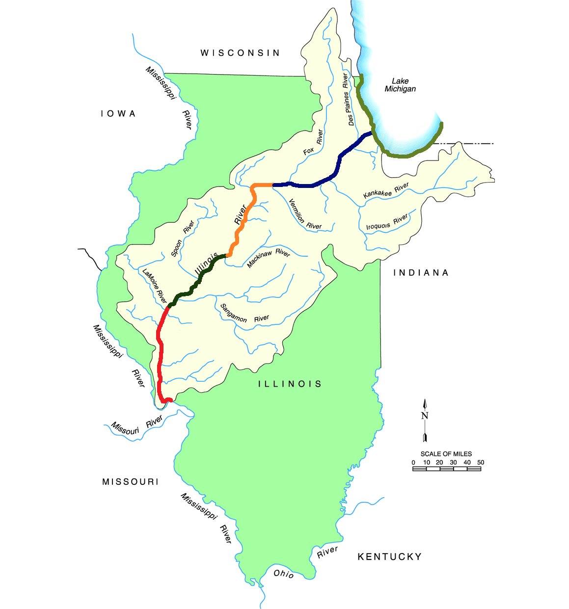
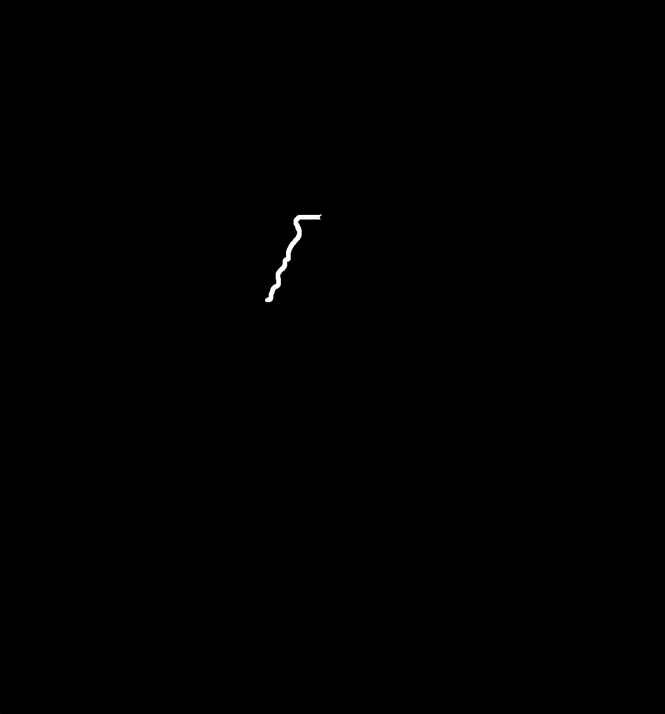
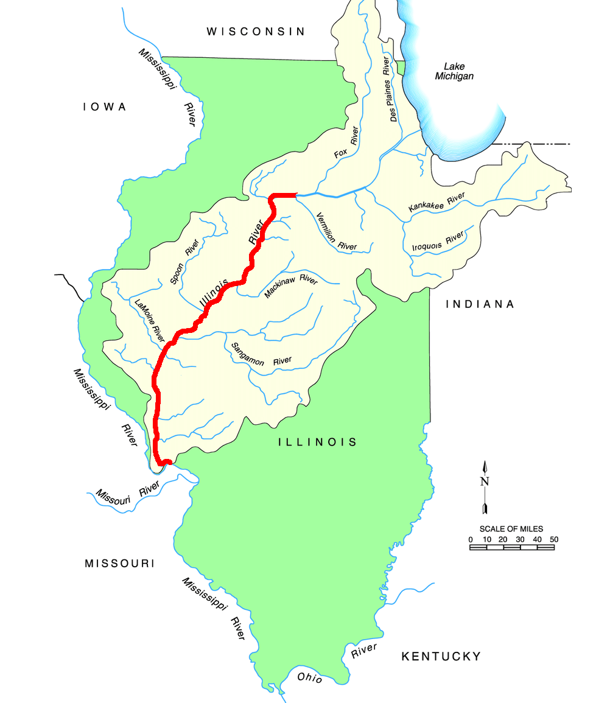
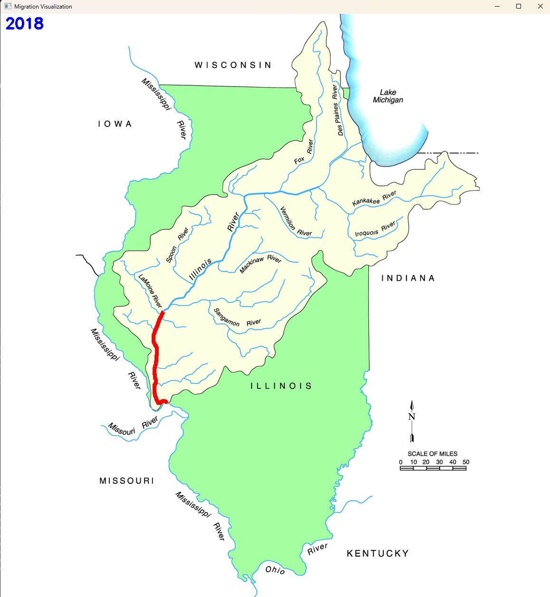

# Migration Software Task MROV 2025 SBRT
## Library Requirements
- Install all the required dependencies by running the line below
  ```pip install -r requirements.txt```

### File based breakdown
#### HSVThresholder.py
**Purpose**: To create an interactive editor/slider window to filter out colors in an image through the Hue/Saturation/Value (HSV) colorspace. 
**Function**: 
image_path: Replace with desired image to threshold, in this case, the image_path is "BaseMarked.png" which is a file that has all the regions mapped in different colors. 



Once run, 3 windows pop up and sliders can be used to find out the HSV values for each region in the image. 

This was done for every region manually and the values per region are listed below

```
"Region, HSV Low thresh, HSV High thresh"
Region1: (179,196,194), (179,255,255)
Region2: (46,130,56), (58,255,255)
Region3: (2,168,184), (12,255,255)
Region4: (111,75,49), (127,255,255)
Region5: (37,168,125), (104,187,141)
```

**Note: This file need not be run as the HSV values have already been obtained (consider this to be a part of the archive)**

#### RegionsGetter.py
**Inputs:** "BaseMarked.png", "BaseUnmarked.png"

First part of the code is reading in the marked image, converting to HSV. 

Then, based on the HSV values obtained from the file above, masks are created for every region to extract the exact region from the marked image. 

Here is how the masks look like

**Region 1:**


**Region 2:**


**Region 3:**


**Region 4:**


**Region 5:**


##### Function: combine_masks
```
# Function to combine the masks based on migration data
def combine_masks(image, data, masks=[mask_reg1, mask_reg2, mask_reg3, mask_reg4, mask_reg5]):
    # Make Blank Mask
    combined_mask = np.zeros((image.shape[0], image.shape[1]), dtype=np.uint8)
    # Iterate through the data and Combine the masks based on the data of Migration
    for i in range(len(data)):
        if data[i] == 'Y':
            combined_mask = cv2.bitwise_or(combined_mask, masks[i])
    # Return the combined mask
    return combined_mask
```
Description: The function based on the migration data, logically OR's the masks obtained above and returns the combined mask

Example: 
Data = [Y, N, N, N, N]
combined_mask = mask1

Data = [Y, Y, Y, N, N]
combined_mask = mask1 + mask2 + mask3

##### Function: display_regions
```
# Function to display the regions on an unmarked image
def display_regions(mask, imagepath = 'BaseUnmarked.png'):
    # Read in the unmarked image
    unmarked = cv2.imread(imagepath)
    color = (0,0,255) # Choose color red for migrations

    # Create a colored overlay with the same shape as the image
    colored_overlay = np.zeros_like(unmarked, dtype=np.uint8)
    colored_overlay[:] = color

    # Apply the mask to the colored overlay
    colored_part = cv2.bitwise_and(colored_overlay, colored_overlay, mask=mask)

    # Apply the inverse mask to the original image
    inverse_mask = cv2.bitwise_not(mask)
    background = cv2.bitwise_and(unmarked, unmarked, mask=inverse_mask)

    # Combine the colored part and the background
    result = cv2.add(background, colored_part)

    return result
```

Description: This function takes in the BaseUnmarked image and the combined masks. It then displays/overlays this combined mask on the base image with the color red. 

Example output:


##### Function: put_year
```
# Function to put the year in the image
def put_year(image, number=6969):

    # Define text properties
    position = (10, 30)  # Top-left corner (x, y)
    font = cv2.FONT_HERSHEY_SIMPLEX  # Font type
    font_scale = 1  # Font size
    color = (255, 0, 0)  # White color in BGR
    thickness = 3  # Thickness of the text

    # Add the number to the image
    cv2.putText(image, str(number), position, font, font_scale, color, thickness)

    return image
```

Description: This function takes in the input image(the output from the display regions function) and a number (which is the year), and then displays/overlays this year in blue color on the top left portion of the input image. 

Example:


##### Rest of the code 
```
if __name__ == '__main__':
    # Read the migration data
    df = pd.read_csv('SampleData.csv')

    # Iterate through each row
    for index, row in df.iterrows():
        data = [row['Region 1'], row['Region 2'], row['Region 3'], row['Region 4'], row['Region 5']]
        combined_mask = combine_masks(image=marked, data=data, masks=[mask_reg1, mask_reg2, mask_reg3, mask_reg4, mask_reg5])
        result = display_regions(combined_mask)
        result = put_year(result, number=row['Year'])
        cv2.imshow('Migration Visualization', result)
        cv2.waitKey(1000)
```

Description: The sample data.csv is read in
```
Year,Region 1,Region 2,Region 3,Region 4,Region 5
2016,N,N,N,N,N
2017,Y,N,N,N,N
2018,Y,N,N,N,N
2019,Y,N,N,N,N
2020,Y,Y,Y,N,N
2021,Y,Y,Y,N,N
2022,Y,Y,Y,N,N
2023,Y,Y,Y,Y,N
2024,Y,Y,Y,Y,N
2025,Y,Y,Y,Y,Y
```
Each row is iterated through using df.iterrows() and the functions made above are used to finish the task. Come day of comp, change the input (Data.csv) with the values given on the venue and run the code. 

For any questions or concerns contact Ruthvick.Bandaru@Stonybrook.edu